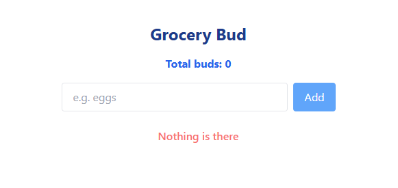
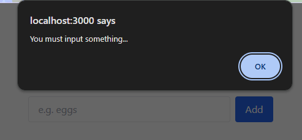
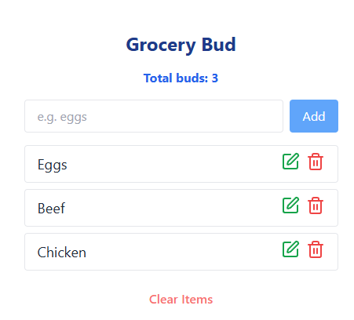
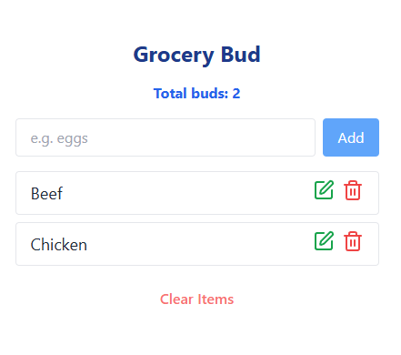
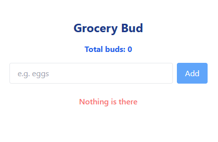

# Grocery App 🛒

I developed a responsive GroceryApp [GroceryApp](https://groceryappreact.netlify.app/) built with **React**, **JavaScript ES6+**, **Tailwind CSS**, and **HTML5**.

## 🛠 Tech Stack

- React (with useState)
- JavaScript (ES6+)
- Tailwind CSS
- HTML5

## 🚀 Features

- ➕ **Add Item** – Add new items to your grocery list.
- 🖊️ **Edit Item** – Modify existing items with inline editing.
- 🗑️ **Delete Single Item** – Remove individual items from the list.
- ♻️ **Clear All Items** – Delete all items with a single click.
- ⚛️ **React Hooks** – Built with functional components and `useState`.
- 💻 **Responsive UI** – Styled using Tailwind CSS for mobile-first design.

## 📸 Preview



Validation:

Input must not be empty.



Task length must be ≤ 10 characters, else an info alert is shown.


🗑️ Delete Item – Users can remove any item by clicking the delete (🗑️) icon.



After successful deletion:



♻️ Clear All Items – Users can remove all items at once by clicking the Clear Items button, resetting the list instantly.



## 📁 Folder Structure

```
src/
├── App.jsx
├── components/
│   ├── Header.jsx
│   ├── InputField.jsx
│   ├── GroceryList.jsx
│   └── SingleGrocery.jsx
├── main.jsx
└── index.css

```

## 🧠 Lessons Learned

- Learned how to manage **state** effectively using React’s `useState` hook.
- Understood how to structure a project using **reusable components**.
- Gained hands-on experience with **conditional rendering** and form handling in React.
- Practiced creating a **responsive UI** with **Tailwind CSS**.
- Improved debugging skills while managing dynamic list updates and interactions.

## 🧩 Challenges Faced

- Handling **edit mode logic** without affecting the original list state.
- Preventing **empty input submissions** while allowing smooth form interaction.
- Managing **component re-renders** and keeping UI state in sync with user actions.
- Designing a clean, user-friendly UI layout using Tailwind’s utility classes.


## 📦 Setup

1. Clone the repo:

   ```bash
   git clone https://github.com/Minoar98/GroceryBud.git
   cd GroceryBud
   ```

2. Install dependencies:

   ```bash
   npm install
   ```

3. Run the app:
   ```bash
   npm run dev
   ```


## Authors

- Github: [@Syed Minoar Hasan](https://github.com/Minoar98)
- Email: [minoarhasan@gmail.com](mailto:minoarhasan@gmail.com)
- Linkedin: [Syed Minoar Hasan](https://www.linkedin.com/in/syed-minaor-hasan-3404b617a/)
